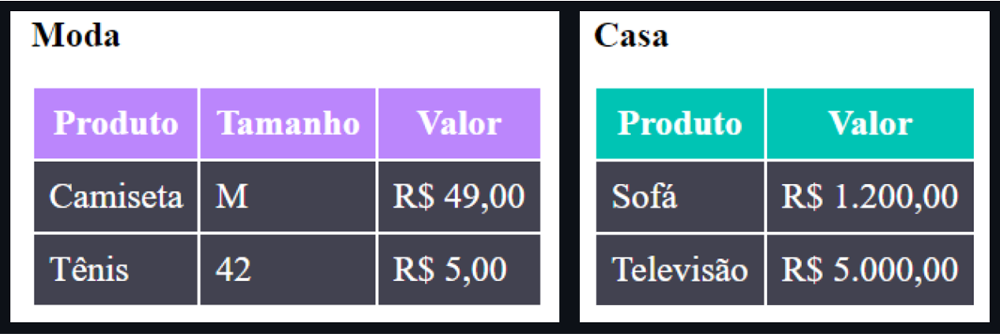

# Desafio de Tabela Estilizada 

Esse é o primeiro desafio do curso DevQuest, no qual os alunos deveriam usar seus conhecimentos básicos de HTML e CSS para criar duas tabelas como no exemplo abaixo:

    

No desafio foi especificado que não deveríamos estilizar as tabelas usando as tags HTML, e foi aí que encontrei uma dificuldade:

<h2 align="center">🤔 Como estilizar as tabelas usando classes, mas tentando deixar o código o menos "verboso" possível? </h2>

Optei por estilizar as bordas e cor da fonte da tabela com as tags, já que para estilizar as bordas seria necessário me referir a cada célula individualmente e isso deixaria o código HTML bastante poluído e difícil de ler.

Até tentei estilizar as bordas criando uma classe 'tabela-padrao' dentro da tag 
, mas não foi suficiente para atingir o design especificado. Talvez tivesse uma forma de fazer, mas com o que sei até aqui, não descobri. 

Entendo que no caso de ter tabelas com estilos diferentes na mesma página, isso teria que ser modificado, de forma a não confundir os estilos e facilidar na hora de fazer modificações.

 
